# 👴 Профіль персонажа: Дід

**Дід** — головний герой гри, спритний та винахідливий персонаж, який використовує підручні засоби (їжу та фізіологію) для боротьби з ворогами.

## 🛠 Навички та Атаки

| Навичка | Опис | Ресурс |
| --- | --- | --- |
| **Стрибок** | Базове переміщення для подолання перешкод. | — |
| **Плювок** | Швидка атака на малу відстань (слабка шкода). | **Слина** (або Насіння) |
| **Кидання яблук** | Потужна атака на відстань (сильна шкода). | **Яблука** |
| **Кислотний пук** | Хмара газу, що станить (приголомшує) ворогів навколо. | **Стиглий горох** |

> **Примітка щодо "Плювка":** Як ресурс можна використати шкалу "Слини", яка поступово відновлюється сама, або збирати "Насіння соняшника".

---

## 🎒 Предмети та Цілі

Для проходження рівнів та виживання Дід має збирати наступні об'єкти:

### 🥗 Розхідні матеріали (Ресурси)

* **Яблука:** Боєприпаси для сильної атаки.
* **Горох:** Заряджає здатність станити ворогів.
* **Малина (стигла):** Додатковий активатор для газової атаки.

### 🏆 Колекційні предмети та Квести

* **Мішки картоплі:** Основна валюта гри.
* **Ковбаса:** Відновлення здоров'я або бонусні очки (треба буде обговорити)
* **Інструменти:** Пилка (для відкриття нових шляхів) та Саламандри (фірмові туфлі для прискорення).

---

## ⚠️ Небезпеки та обмеження

* **Зелена малина:** Шкідливий об'єкт. Ресурс обмежений, а випадкове споживання (1–2 попадання) призводить до втрати енергії.
* **Пастки:** Об'єкти, яких слід уникати, щоб не втратити здоров'я.

##  Арт Галерея

---

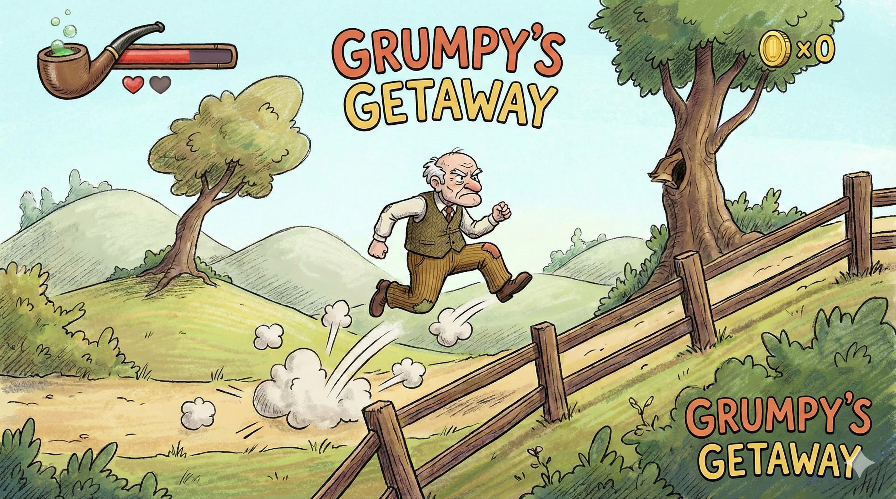

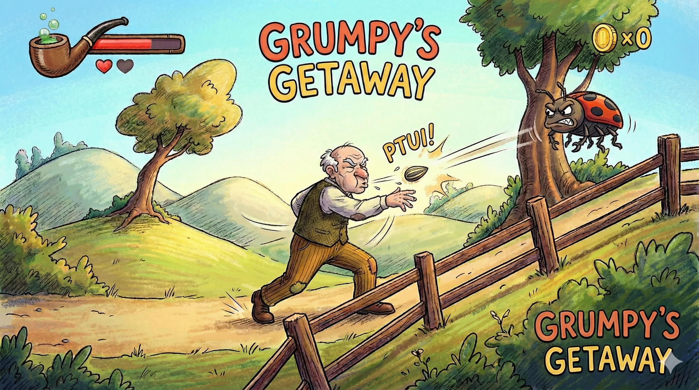

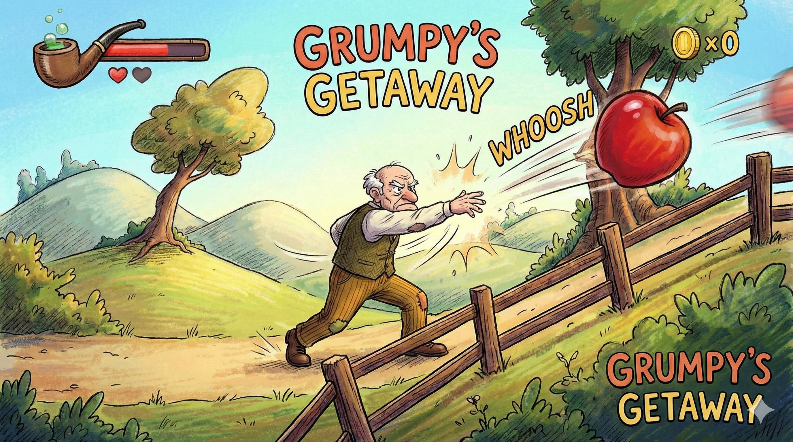

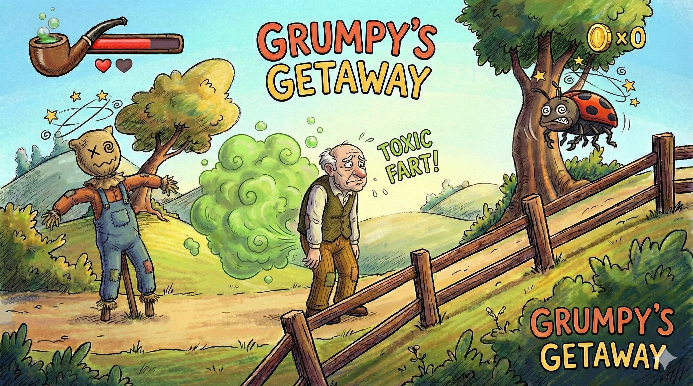
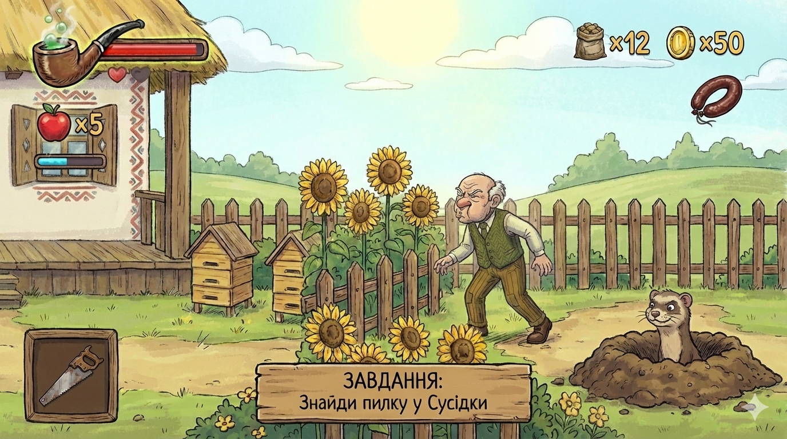
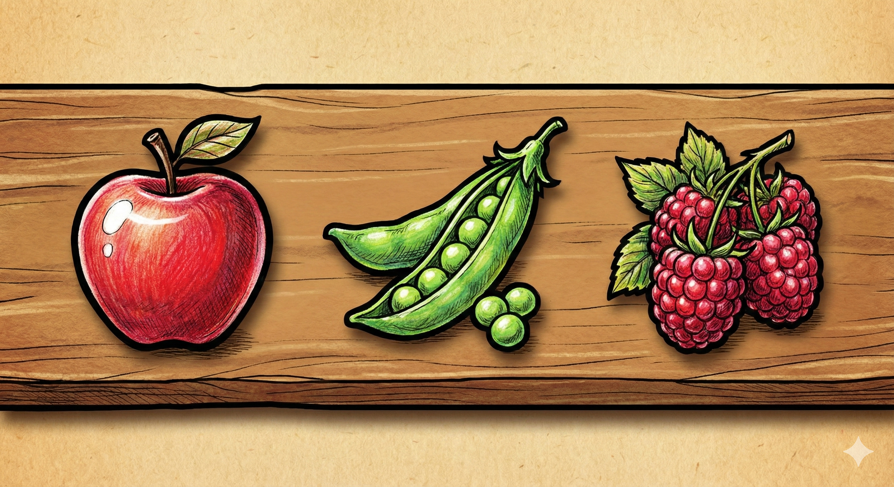
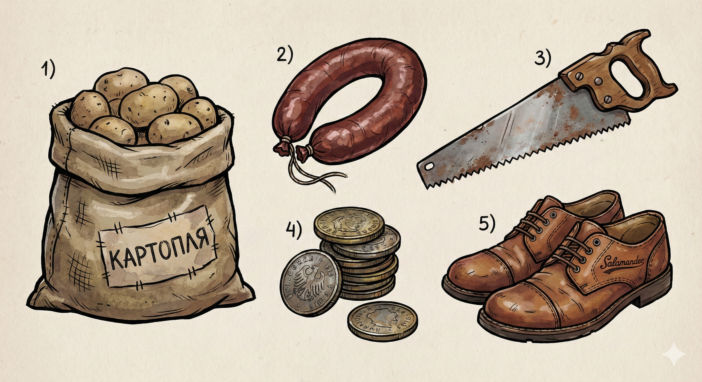
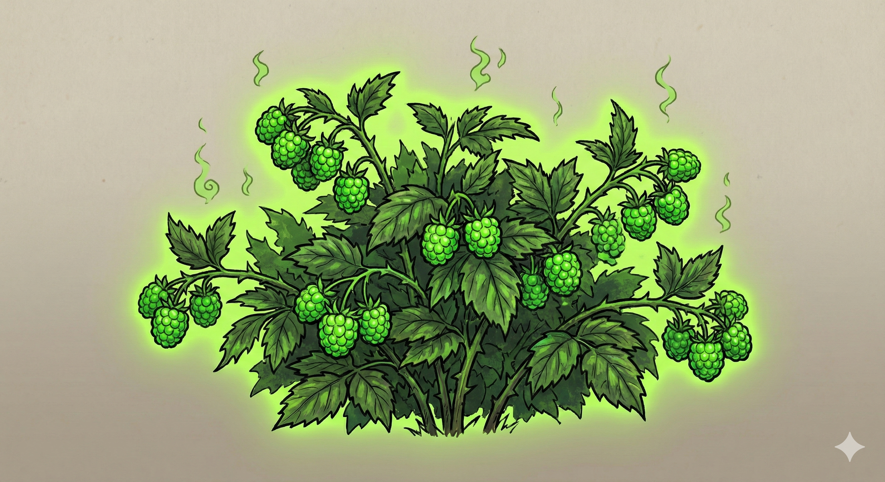
=======================================================
 
# 👵 NPC-союзник: Баба

**Баба** — це острівець безпеки для Діда. Вона зустрічається в перервах між рівнями або у спеціальних "тихих зонах". Її головна роль — підкріпити сили старого та нагадати йому, хто в домі господар.

## 🥣 Основна функція: "Бабин Суп"

* **Ефект:** Миттєво відновлює **100% здоров'я (HP)**.
* **Умова:** Щоб Баба зварила суп, Дідові іноді потрібно принести інгредієнти, які він збирає на рівнях (**Картоплю** або **Ковбасу**).
* **Бонус:** Якщо суп зварений зі "стиглого гороху", Дід отримує бонусний запас газу для "Кислотного пуку".

---

## 💬 Діалоги про "Ластівку"

Дід має дивну фобію або просто вередує: він терпіти не може, коли в супі плаває щось, що нагадує йому ластівку (це може бути лавровий лист, корінь селери або просто невдала гренка).

### Випадкові фрази при зустрічі (приклад): 

> **Баба:** — Іди їж, старий, а то геть змарнів на тих городищах!
> **Дід:** — А ти добре подивилася? Там точно ніякої **ластівки** в каструлю не залетіло?
> **Баба:** — Та яка ластівка, господи! Це лавровий лист! Пий юшку і не вигадуй!

---

### Варіанти діалогів для гри:

| Ситуація | Фраза Баби | Відповідь Діда |
| --- | --- | --- |
| **Початок лікування** | "Ось, сьорбни гаряченького, бо ноги протягнеш." | "Тільки щоб без пір'я! Я знаю твої приколи з ластівками..." |
| **Якщо HP повне** | "Куди ти лізеш? Тільки-но поїв, іди працюй!" | "Дивлюся, чи ластівки в ополонці не плавають..." |
| **Після зцілення** | "Ну що, полегшало? Біжи вже, козаче." | "Суп добрий, але один листок підозріло на крило скидався. Дивись мені!" |

---

## 🎒 Механіка взаємодії

1. **Зустріч:** Дід підходить до Баби біля великого казана.
2. **Обмін:** Якщо у Діда є мішок картоплі → з'являється кнопка **"Пообідати"**.
3. **Анімація:** Дід гучно сьорбає, з'являється напис **"+HP"**, а над головою Діда вилітає перекреслена іконка ластівки 🐦🚫.

---

### Чому це працює:

* **Контраст:** Сусідка — злий бос, Баба — добрий союзник. Це створює баланс у грі.
* **Гумор:** "Ластівка в супі" — це абсурдна деталь, яка запам'ятовується гравцям і робить Діда живим персонажем зі своїми дивацтвами.

⸻
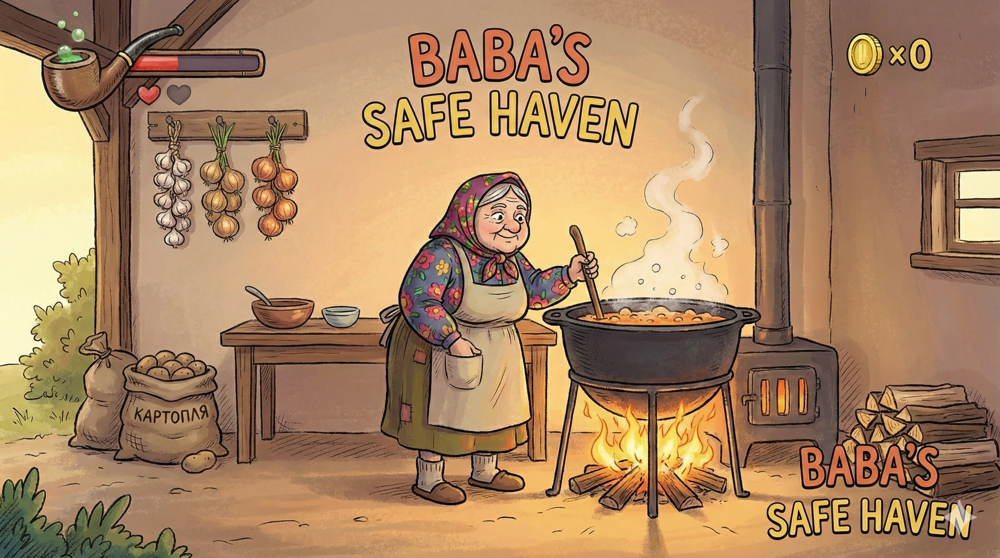

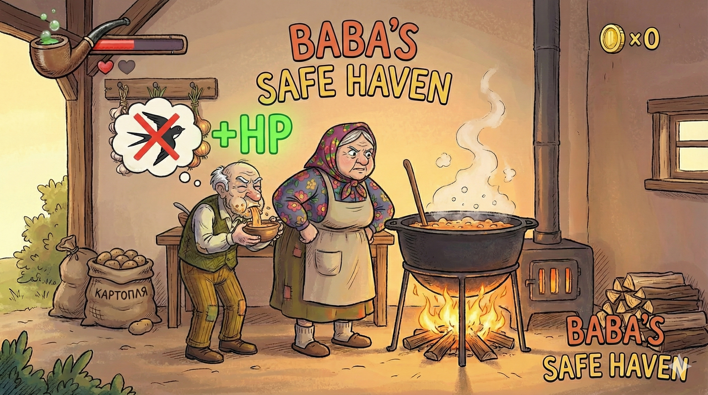

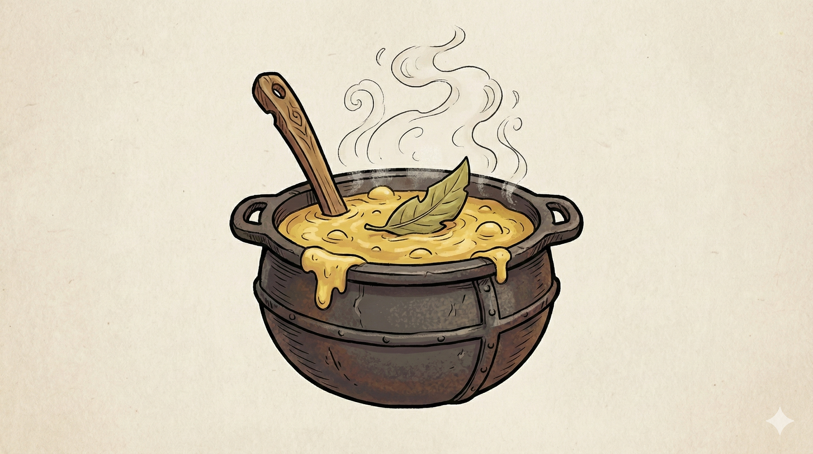

=================================

# 🧒 Навігатор: Онук

**Онук** — це сучасний і кмітливий персонаж, який приїхав до Діда на канікули. Він краще знає, де лежать скарби та куди веде шлях, тому саме він ставить завдання і стежить за прогресом.

## 📋 Роль у грі

### 1. Початок рівня (Брифінг)

На початку кожного рівня запускається коротка кат-сцена. Онук пояснює Дідові, що сталося і що треба знайти.

* **Приклад:** *"Діду, Сусідка знову закрила хвіртку на замок! Знайди пилку в її саду, інакше ми не вивеземо картоплю до міста."*

### 2. Завершення рівня (Перехід)

Коли всі цілі рівня виконані (зібрано достатньо мішків картоплі або знайдено квестовий предмет), Онук з’являється в кінці локації біля виходу.

* **Функція:** Тільки після розмови з Онуком рівень вважається завершеним. Він відкриває шлях (наприклад, перелазить через паркан або відкриває ворота) і веде Діда далі.

### 3. Суворі правила

* **Жодних підказок:** Онук видає завдання і йде у своїх справах (сидіти в телефоні або чекати на безпечній позиції). Під час самого ігрового процесу Дід залишається сам на сам із ворогами та пастками. 
* **Безпека:** Онук ніколи не потрапляє під атаки Сусідки чи собак. Він "поза грою", поки Дід працює (якщо онук буде присутній на рівні з дідом).

---

## 💬 Діалоги та Квести (приклад)

| Момент | Фраза Онука | Завдання (Квест) |
| --- | --- | --- |
| **Рівень 1** | "Діду, Баба сказала без ковбаси не повертатися. Шукай її на ворожій території!" | **Ціль:** Знайти 3 кільця ковбаси. |
| **Перед Босом** | "Обережно, там Сусідка вийшла на полювання. Просто так вона тебе не пропустить!" | **Ціль:** Перемогти Сусідку. |
| **Фінал рівня** | "Ого, ти ще живий! Гарна робота, діду. Ходімо, я бачив там далі старі Саламандри!" | **Дія:** Перехід до наступної локації. |

---

## 🎨 Візуальний образ (треба буде обговорити)

Онук виглядає як контраст до Діда:

* Одягнений у яскраву кепку та худі.
* Постійно тримає в руках смартфон (який він називає "радаром" для пошуку картоплі).
* Має рюкзак, куди складає все, що Дід приносить з рівня.

> **Примітка для розробки:** Кат-сцени з Онуком мають бути короткими (5-10 секунд), щоб не переривати темп гри, але вони важливі для розуміння, куди гравцеві йти далі.

---

⸻

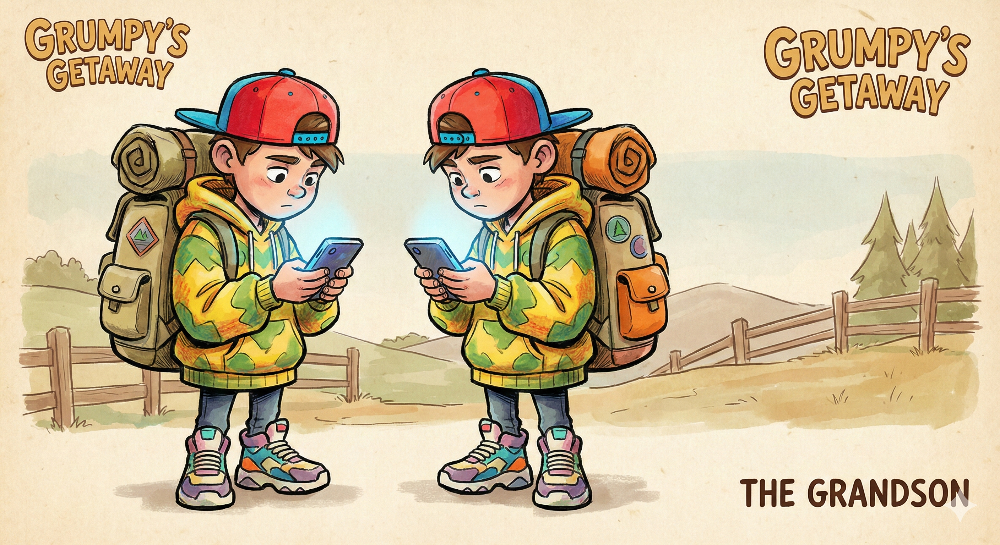
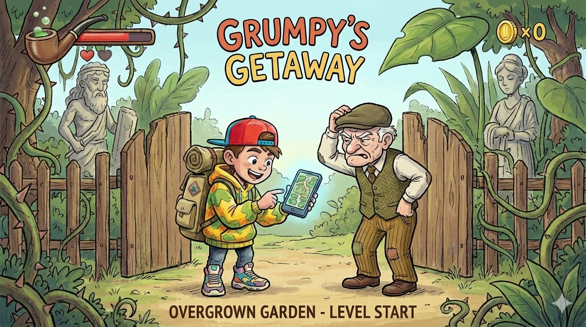
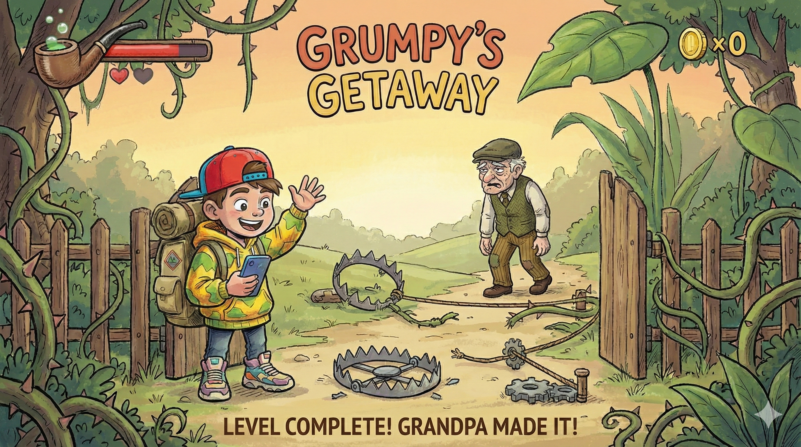

================================================

# 🏠 Бос: Розлючена Сусідка

**Сусідка** — це перший серйозний бос, який охороняє прохід до наступної локації. Вона впевнена, що Дід зазіхає на її територію, тому використовує весь свій "господарський" арсенал для захисту.

---

## 🛤 Шлях до Боса (Рівень-випробування)

Перш ніж дійти до самої Сусідки, гравець має подолати її подвір’я, яке перетворене на смугу перешкод.

### 🐾 Вороги: Люті Песики

* **Особливість:** Вони **невразливі**. Дід не може їх перемогти (плювки чи яблука на них не діють).
* **Поведінка:** Песики прив'язані на ланцюгах або бігають за парканом. Вони кидаються на гравця, якщо той підходить надто близько.
* **Тактика:** Тільки обходити або перестрибувати. Потрібно розраховувати таймінг їхнього гавкоту та стрибків.

### 🪤 Перешкоди: Пастки

* **Мишоловки та Капкани:** Приховані в траві. Якщо наступити — Дід на певний час завмирає (стан) і втрачає здоров'я.
* **Розлита олія/помиї:** Слизькі ділянки, де персонаж стає важкокерованим.

---

## ⚔️ Битва з Босом: Сусідка

Бій відбувається на городі або біля хати. Сусідка стоїть на підвищенні (на ганку або за парканом), що робить її недосяжною для простих атак ближнього бою.

### 📑 Механіки та Атаки

| Тип атаки | Опис | Як протидіяти |
| --- | --- | --- |
| **Обстріл банками** | Кидає скляні банки з огірками/варенням. При розбитті вони залишають уламки або липку пляму. | Ухилятися вбік або розбивати банки в польоті яблуком. |
| **"Ату його!"** | Випускає на арену одного з маленьких, але дуже швидких песиків. | Тимчасово застанити песика "Кислотним пуком" і атакувати Сусідку. |
| **Свіжа пастка** | Може кинути під ноги Діду капкан прямо під час бою. | Стрибати, не стояти на одному місці. |

---

## 🎯 Мета та Слабкість

* **Слабкість:** Коли Сусідка готується кинути велику 3-літрову банку, вона стає нерухомою. Це ідеальний момент для **сильної атаки яблуком**.
* **Перемога:** Після кількох влучних попадань яблуками Сусідка відступає в хату, гублячи **Пилку** або **Гроші**, які потрібні Діду для подальшого проходження.

> ### 💡 Порада для гравця:
> 
> 
> Використовуй "Кислотний пук" (ресурс: Горох), коли песики притискають тебе до краю екрана. Це дасть 2-3 секунди, щоб перестрибнути їх та зайняти вигідну позицію для кидка яблука в Сусідку.

---

⸻
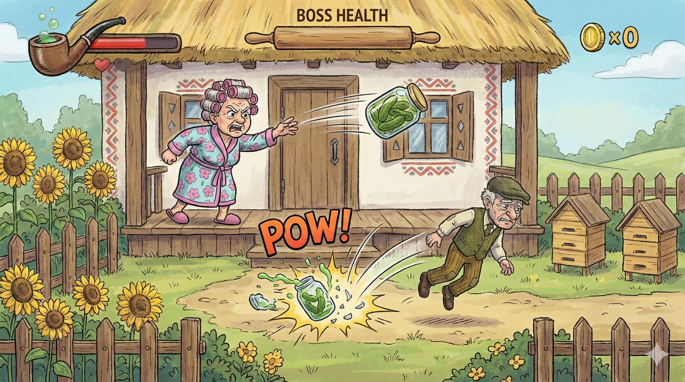
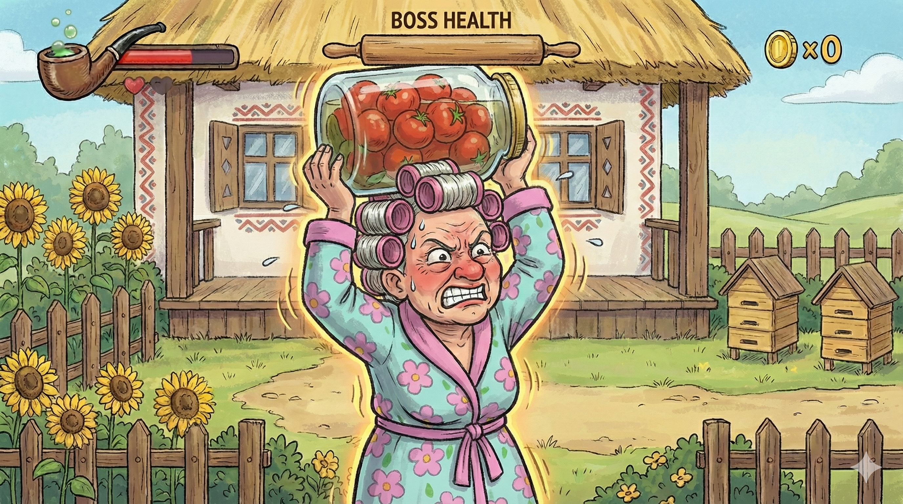
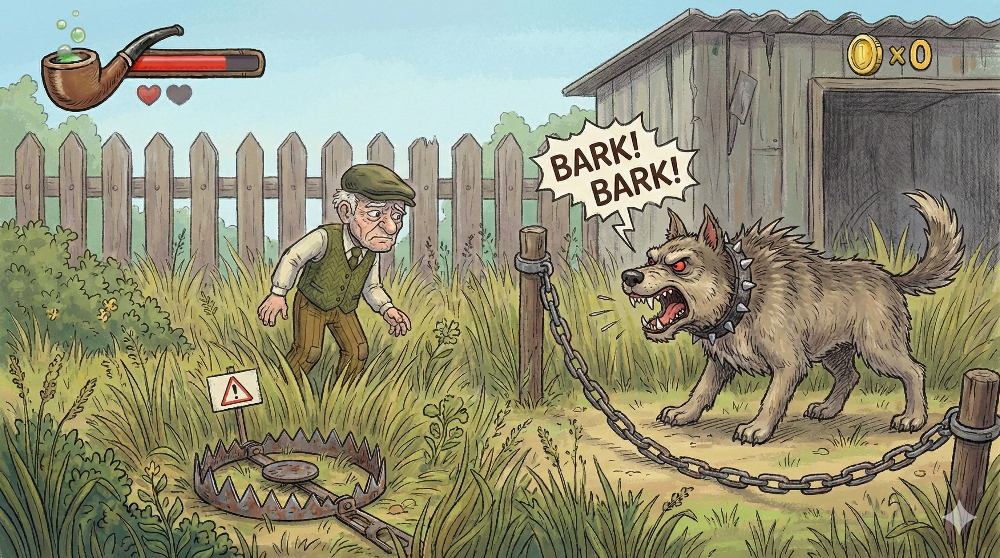
================================================

# 🦨 Ворог/Бос: Тхір (Смердюча Погибель)

**Тхір** — це найбільш непередбачуваний супротивник у грі. Він уособлює підступність та бруд. Через свій специфічний запах та здатність з’являтися нізвідки, він стає справжнім нічним жахом для Діда.

---

## 🐾 1. Звичайний стан: Підземний Шкідник (NPC-ворог)

У звичайному режимі гри Тхір діє як дрібний злодій та провокатор.

* **Поява:** Раптово вистрибує з-під землі (з кротовин або нір) прямо перед носом у Діда.
* **Крадіжка:** Якщо Дід забарився біля мішка картоплі або ковбаси, Тхір може вхопити предмет і миттєво заритися назад у землю. Щоб повернути вкрадене, треба встигнути влучити в нього **плювком**.
* **Дистанційна атака:** Кидається в Діда **зеленою малиною** (забирає енергію) або уламками **шиферу**.

---

## 👺 2. Стан Боса: Гігантський Тхір-Галюцинація

Ця форма з’являється лише тоді, коли **здоров’я Діда падає до критичної позначки (нижче 20-30%)**.

* **Тригер:** Через слабкість та втому у Діда починаються галюцинації. Маленький тхір візуально розростається до розмірів слона, небо стає фіолетовим, а звуки викривляються.
* **Аура Сморду:** Навколо Гігантського Тхора поширюється зелений туман.
* **Механіка:** Якщо Дід перебуває надто близько до боса більше 3-х секунд, його здоров'я починає швидко зменшуватися від нестерпного запаху.

* **Атаки Боса:**
* **Шиферний дощ:** Тхір тупає лапою, і зверху падають листи шиферу та скляні банки.
* **Галюциногенний кидок:** Кидає величезну зелену малину, яка при влучанні дезорієнтує гравця (інверсія керування: вліво — це вправо).

---

## ⚔️ Бойова тактика та вразливості

| Зброя | Ефект на Тхора |
| --- | --- |
| **Плювок** | Найкраща зброя проти малого Тхора. Збиває його з ніг і змушує випустити вкрадений предмет. |
| **Яблуко** | Завдає великої шкоди Гігантському Тхору. Це єдиний спосіб прогнати галюцинацію. |
| **Кислотний пук** | **Марно!** Тхір сам настільки смердючий, що газові атаки Діда на нього не діють. Більше того, це може його навіть "підбадьорити". |

---

## 🤢 Ефект "Сморду"

Щоб гравець розумів небезпеку, на екрані з'являються візуальні ефекти:

1. **Позеленіння країв екрана.**
2. **Тремтіння камери** (Діда нудить).
3. **Звук кашлю** персонажа.

---

## 💬 Коментарі персонажів:

* **Онук (на початку):** *"Діду, стережися нір! Тхори зараз голодні, потягнуть твою ковбасу швидше, ніж ти кліпнеш оком!"*
* **Баба (після зустрічі з босом):** *"Ой, діду, та від тебе тхне за версту! Сьорбни супу, а то скоро почнеш бачити тхорів розміром з корову..."*
* **Дід (про себе):** *"Фу-у-у... Таке враження, що він не в норках живе, а в каналізації у Сусідки!"*

---

### Що цей персонаж додає грі:

1. **Елемент несподіванки:** Гравець ніколи не почувається в безпеці, навіть на зачищеній ділянці.
2. **Динамічна складність:** Поява боса залежить від стану гравця, що створює унікальні моменти "останнього шансу" на виживання.
3. **Ризик/Нагорода:** Треба швидко реагувати, щоб не втратити цінні ресурси (ковбасу/картоплю).

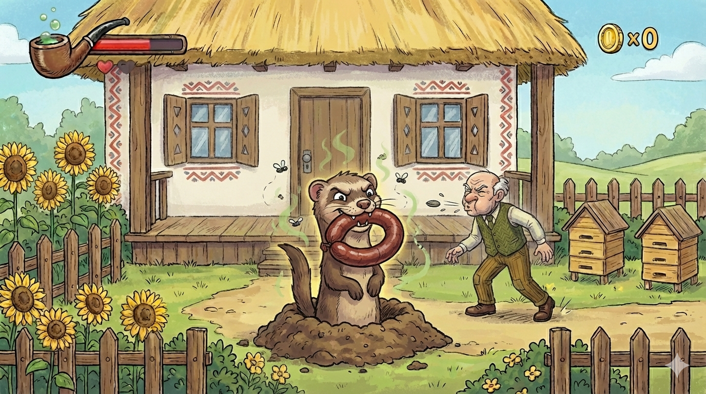
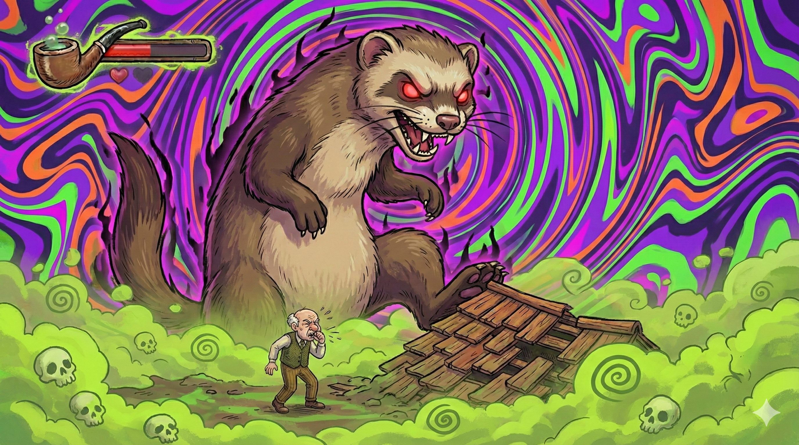
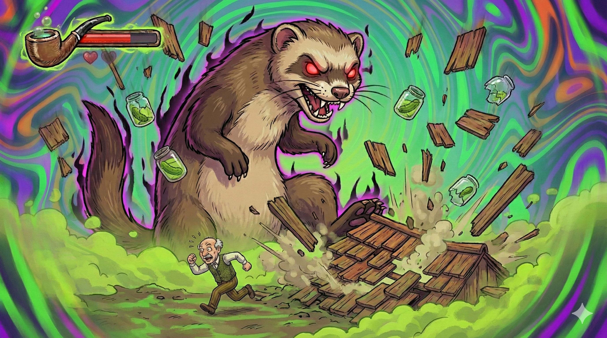

